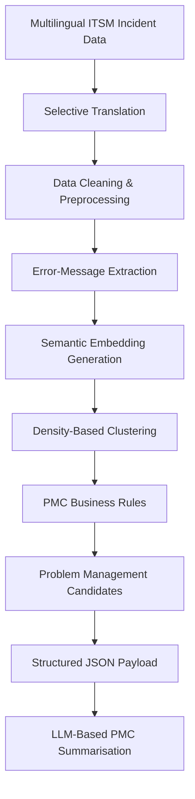

# 🚗 AI-Powered Problem Management Candidate Detection for ITSM

**Master's Thesis Project – CARIAD / Volkswagen Group**

> **Portfolio Notice**
>
> This repository is a sanitized portfolio version of an industry master's thesis project completed at CARIAD / Volkswagen Group.
>
> Original datasets, credentials, confidential configuration, internal endpoints, and active company API integrations have been removed for confidentiality and security reasons.
>
> The repository is intended to demonstrate the pipeline architecture, processing logic, modular Python design, experimentation approach, and selected implementation developed during the project.

---

## 📌 Overview

This project implements the core workflow of an AI-assisted **Problem Management Candidate (PMC) detection pipeline** for IT Service Management (ITSM) incident data.

The project started with an assessment of the AI readiness of six ITSM processes. Based on process requirements, stakeholder input, data availability, and data quality, recurring-incident detection was selected as the use case for implementation.

The technical solution was developed using **18,944 multilingual automotive incident records** and combines Natural Language Processing, semantic embeddings, density-based clustering, organisation-specific decision rules, and Generative AI.

The overall workflow is:

**incident data → preprocessing → selective translation → error-message extraction → semantic embeddings → clustering → PMC business rules → structured JSON payloads → LLM-based summarisation**

The public repository contains a sanitized implementation of the core pipeline. Company data, private credentials, internal endpoints, and active enterprise API integrations are intentionally excluded.

---

## 🏗️ Pipeline Architecture



The machine-learning stage identifies semantically related incidents.

Clustering alone is not treated as sufficient evidence that a group represents the same recurring technical problem. Additional business rules are applied before a cluster is converted into a Problem Management Candidate.

Generative AI is used only after PMC candidates have been identified.

---

## ✨ Key Features

- Processing of multilingual ITSM incident data
- Selective translation of non-English ticket content
- Text cleaning and preprocessing
- Technical error-message extraction with fallback logic
- Sentence-BERT embedding generation
- Density-based clustering using DBSCAN
- Organisation-specific PMC candidate rules
- Configurable minimum-incident and recurrence-window logic
- Structured JSON payload generation
- LLM-based structured PMC summarisation
- Modular Python pipeline design
- Configuration-driven pipeline behaviour

---

## 🧪 Experimentation & Model Selection

The project did not begin with a predefined embedding or clustering method.

Several approaches were compared before selecting the configuration used in the final pipeline.

| Component | Approaches evaluated |
|---|---|
| Text representation | TF-IDF, Word2Vec, Sentence-BERT MiniLM, Sentence-BERT MPNet |
| Clustering | DBSCAN, HDBSCAN |
| Evaluation | Quantitative clustering metrics + manual cluster review |
| Generative AI | Four GPT models |
| Selected LLM | GPT-4.1-mini |

The clustering approaches were evaluated using both quantitative metrics and manual review.

This was important because a configuration with good numerical clustering metrics did not automatically produce groups that were semantically meaningful or operationally useful for the Problem Management process.

The public repository focuses on the selected implementation rather than reproducing every experimental configuration explored during the thesis.

---

## 🔎 Problem Management Candidate Logic

Semantic similarity alone was not used to create a Problem Management Candidate.

The final candidate logic combined semantic grouping with organisation-specific conditions including:

- semantic similarity between incidents
- matching incident category and function
- matching vehicle software generation
- a minimum of **five related incidents**
- recurrence within a **21-day window**

This separates the machine-learning clustering stage from the operational rules used to determine whether a group of incidents should become a PMC candidate.

---

## 🌍 Multilingual Data Processing

The original incident dataset contained German, Italian, Romanian, and English text.

Selective translation was applied where required using the Microsoft Translator API before downstream text processing.

The preprocessing workflow also included:

- handling missing values
- standardising relevant fields
- cleaning titles and descriptions
- extracting technical error information
- preparing text for semantic embedding generation

The public repository does not include the original company dataset.

---

## 🤖 Generative AI Summarisation

Generative AI was added as the final stage of the workflow after Problem Management Candidates had already been identified through deterministic ML and business-rule logic.

Relevant candidate-level and incident-level information was transformed into a structured JSON payload before being passed to the LLM.

### Prompt Development

The summarisation prompt was developed iteratively rather than written once and used immediately.

The workflow included:

1. Defining the information required for Problem Management documentation.
2. Designing a structured summarisation prompt.
3. Prototyping and refining prompt versions using **Microsoft Copilot**.
4. Reviewing generated summaries for factual completeness, source consistency, and format adherence.
5. Moving the stabilised prompt into the company LLM API workflow.
6. Comparing several GPT models using the same summarisation task.

Microsoft Copilot was used during prompt prototyping to reduce unnecessary experimentation against the company LLM API.

### Input Optimisation

Additional cleaning was applied before LLM summarisation to remove content that did not contribute useful context.

Examples included unnecessary questionnaire labels, headings, placeholders, separators, and irrelevant ticket content.

This reduced unnecessary token usage while keeping the technical information required for the summary.

### Model Evaluation

Four GPT models were compared:

- GPT-5.0-nano
- GPT-4o-mini
- GPT-4.1-nano
- GPT-4.1-mini

The comparison considered factors including:

- format adherence
- preservation of relevant source information
- response quality
- response time

**GPT-4.1-mini** was selected for the final workflow.

The public repository contains the prompt structure and summarisation logic, but active company LLM credentials and internal endpoints are intentionally excluded.

---

## 📦 Structured LLM Input

For each detected PMC candidate, relevant information was converted into a structured JSON payload.

Candidate-level information included fields such as:

- PMC identifier
- number of related incidents
- involved brands and locations
- unique extracted errors

Incident-level information included fields such as:

- incident number
- outage timestamp
- title
- cleaned description
- extracted error information
- category and function
- vehicle software generation
- affected configuration item
- brand
- location
- input channel

The structured representation helped keep the LLM input consistent and reduced unnecessary variation in prompt context.

---

## 📁 Project Structure

```text
PMC-Detection-ITSM/
│
├── config/
│   └── config.yaml
│
├── prompts/
│   └── pmc_prompt.txt
│
├── src/
│   ├── clustering/
│   │   └── clusterer.py
│   │
│   ├── embeddings/
│   │   └── text_embeddings.py
│   │
│   ├── pmc/
│   │   ├── pmc_creation.py
│   │   ├── pmc_payload_builder.py
│   │   └── pmc_summarizer.py
│   │
│   ├── preprocessing/
│   │   ├── cleaning.py
│   │   ├── error_extraction.py
│   │   └── llm_description_cleaner.py
│   │
│   └── translation/
│       └── translator.py
│
├── main.py
├── pipeline.py
├── preprocess_pipeline.py
├── requirements.txt
├── .gitignore
└── README.md
```

### Main Components

| File | Purpose |
|---|---|
| `main.py` | Entry point for the complete pipeline |
| `pipeline.py` | Coordinates the major pipeline stages |
| `preprocess_pipeline.py` | Coordinates preprocessing operations |
| `cleaning.py` | Dataset cleaning and preparation |
| `translator.py` | Selective translation of non-English text |
| `error_extraction.py` | Extracts technical error information from incident text |
| `llm_description_cleaner.py` | Additional cleaning before LLM summarisation |
| `text_embeddings.py` | Generates Sentence-BERT embeddings |
| `clusterer.py` | Performs density-based clustering |
| `pmc_creation.py` | Applies PMC candidate-generation logic |
| `pmc_payload_builder.py` | Creates structured JSON payloads |
| `pmc_summarizer.py` | Handles LLM-based PMC summarisation |
| `pmc_prompt.txt` | Structured summarisation prompt |

---

## ⚙️ Configuration

Pipeline behaviour is controlled through:

```text
config/config.yaml
```

A simplified configuration is shown below:

```yaml
data:
  input_path: "<your_dataset.xlsx>"

translation:
  enabled: false

embeddings:
  model: "all-MiniLM-L6-v2"
  batch_size: 32

clustering:
  eps: 0.14
  min_samples: 5

pmc:
  min_tickets: 5
  window_days: 21

payload:
  output_dir: "outputs/payloads"

summarisation:
  enabled: false
  prompt_file: "prompts/pmc_prompt.txt"
  model: "gpt-4.1-mini"
  output_dir: "outputs/summaries"
```

Company-specific credentials and internal API information are intentionally not documented here.

---

## ▶️ Installation

### 1. Clone the repository

```bash
git clone https://github.com/joyaljr12/PMC-Detection-ITSM.git
cd PMC-Detection-ITSM
```

### 2. Create a virtual environment

```bash
python -m venv .venv
```

### macOS / Linux

```bash
source .venv/bin/activate
```

### Windows

```bash
.venv\Scripts\activate
```

### 3. Install dependencies

```bash
pip install -r requirements.txt
```

---

## ▶️ Running the Pipeline

Configure the input dataset path in:

```text
config/config.yaml
```

Then run:

```bash
python main.py
```

Depending on the enabled stages and available configuration, the pipeline performs:

1. incident-data loading
2. preprocessing and text cleaning
3. selective translation
4. technical error-message extraction
5. semantic embedding generation
6. density-based incident clustering
7. PMC business-rule evaluation
8. structured JSON payload generation
9. LLM-based PMC summarisation when enabled

Because the original dataset and active company integrations are not included, the public repository does not reproduce the complete CARIAD environment end-to-end without suitable input data and API configuration.

---

## 🔐 Confidentiality & Public Repository Limitations

This repository is provided as a technical portfolio representation of the project.

The following are intentionally excluded:

- original CARIAD / Volkswagen Group datasets
- real ITSM incident records
- internal company endpoints
- API credentials and access tokens
- confidential organisation-specific configuration
- internal infrastructure details
- active company LLM integrations

The repository therefore demonstrates the **architecture, processing logic, selected implementation, and engineering approach**, rather than reproducing the original enterprise environment.

---

## 🛠️ Technology Stack

### Programming & Data

- Python
- pandas
- NumPy
- JSON
- YAML

### Machine Learning & NLP

- Sentence-BERT
- TF-IDF
- Word2Vec
- DBSCAN
- HDBSCAN
- scikit-learn
- semantic embeddings
- text clustering

### Generative AI

- GPT models
- prompt engineering
- Microsoft Copilot
- structured LLM inputs
- LLM API integration

### APIs & Tools

- Microsoft Translator API
- Postman
- Git
- GitHub

---

## 🎯 What This Project Demonstrates

This project demonstrates hands-on experience with:

- translating an operational business problem into an AI use case
- assessing data quality and AI readiness
- processing noisy multilingual real-world text data
- designing end-to-end Python NLP pipelines
- comparing alternative representation and clustering approaches
- semantic text representation
- density-based clustering
- combining machine learning with explicit business rules
- structured Generative AI workflows
- iterative prompt engineering
- LLM model comparison and evaluation
- token-aware input preparation
- API-based AI integration
- modular Python project design
- communicating technical results within an enterprise environment

---


